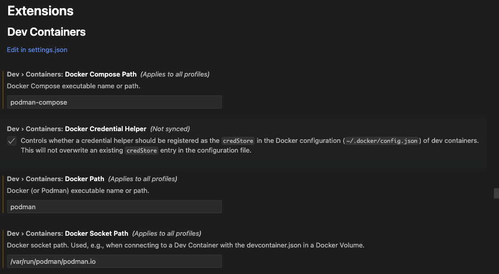

# Device Containers Getting Started Guide

This guide walks you through using a [Development Container](https://containers.dev/)
configured with all the tools needed to build and run Triton (or Triton-CPU).
The setup is optimized for local development using Visual Studio Code.

## Prerequisites

- [VSCode](https://code.visualstudio.com/)
- [Docker](https://docs.docker.com/)
- [NVIDIA Container Toolkit](https://docs.nvidia.com/datacenter/cloud-native/container-toolkit/latest/install-guide.html)
  (only needed for GPU use)
- [VSCode Dev Containers Extension](https://marketplace.visualstudio.com/items?itemName=ms-vscode-remote.remote-containers)
- `jq` (used by setup scripts)

> **Note**: Full Dev Container setup details can be found
> [here](https://code.visualstudio.com/docs/devcontainers/tutorial#_prerequisites).

> **GPU users** must install the NVIDIA Container Toolkit for proper CUDA support.

> **Podman users**: See additional devcontainer settings below.


---

## How to Use These Containers

### Recommended (Sparse Checkout Script)

```bash
wget -qO- https://raw.githubusercontent.com/redhat-et/triton-dev-containers/main/.devcontainer/scripts/bootstrap-devcontainer.sh | bash -s triton-cpu
```

> Replace `triton-cpu` (above) with one of the supported variants:
>
> - `triton`
> - `triton-cpu`
> - `triton-amd`

### Option 2: Clone Everything

```bash
git clone https://github.com/redhat-et/triton-dev-containers.git
cd triton-dev-containers
make devcontainers
```

## Basic Workflow

1. Dev Container Configuration: `.devcontainer/triton/devcontainer.json`
   file is set up with configuration details: the Docker image to use,
   extensions to install, environment variables...
   > **_NOTE_**: The Dev Container configuration provided supports both root
   (not recommended) and non-root (recommended) users.
2. Open project in Container: Open the project folder in VS Code, build and
   connect to the development container.
3. Development: Work as usual, with access to tools and dependencies defined
   in the container.

### Running in Visual Studio Code

Follow these steps to launch and work with the Dev Container in Visual
Studio Code.

Open the project in Visual Studio Code. A pop up will appear asking to reopen
the project in a Dev Container.


If the pop up doesn't appear, the container can be launched by accessing the
Visual Studio Code Command Palette and looking for the:
`Dev Containers: Reopen in Container` option as shown below.


Visual Studio Code will relaunch inside the Dev Container.

When the container is ready the Triton tutorials can be run as follows:

```bash
pip install -e './python[tutorials]'
```

> **_NOTE_**: This step can take a few minutes to complete.

```bash
python python/tutorials/01-vector-add.py
```

## Building Triton with a Custom LLVM in Dev Container

> **_NOTE_**: This setup takes a WHILE to complete

To build Triton with a custom version of LLVM, please enable the following in
the `devcontainer.json` file:

```json
"CUSTOM_LLVM": "true"
```

To use a different commit for LLVM than what's specified in
[`cmake/llvm.hash`](../../cmake/llvm-hash.txt), change the following line in the
[`Dockerfile`](../triton/Dockerfile) from:

```dockerfile
COMMIT=$(curl -s https://raw.githubusercontent.com/triton-lang/triton/refs/heads/main/cmake/llvm-hash.txt) &&
```

to

```dockerfile
COMMIT=49af6502 &&
```
